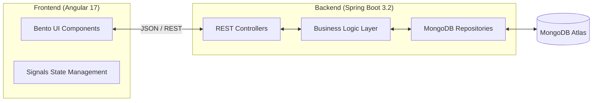

### Premium Movie Review & Rental Platform
**SE1020 Object-Oriented Programming | SOA Architecture | Modern Bento UI**

---

[](https://angular.io/)
[](https://spring.io/projects/spring-boot)
[](https://www.mongodb.com/atlas/database)
[](https://www.oracle.com/java/)

**CineVault** is a state-of-the-art movie platform designed for seamless movie discovery, rentals, and community-driven reviews. Built with a robust **Service-Oriented Architecture (SOA)**, it features a high-end, editorial-grade typographic system and a sleek dark-themed **Bento Box UI** with glassmorphism effects.

---

## ✨ Key Features

- 🎭 **Comprehensive Catalogue**: Browse movies by genre, search, and view detailed filmographies.
- 📦 **Rental System**: Securely rent digital or physical copies with automated late-fee calculation.
- ⭐ **Social Reviews**: Submit ratings and detailed reviews; verified renter badges for authentic feedback.
- 👤 **User Profiles**: Manage personal watchlists, rental history, and account settings.
- 🛡️ **Admin Command Center**: Advanced KPI dashboard for managing movies, users, rentals, and cast members.
- 💎 **Premium Experience**: Modern glassmorphism, horizontal smooth scrolling, and Material Symbols integration.

---

## 🏗️ Architecture Overview

The project follows a decoupled **SOA approach**, ensuring scalability and clear separation of concerns.



---

## 🛠️ Tech Stack

| Layer | Technology |
| :--- | :--- |
| **Frontend** | Angular 17 (Standalone Components, Signals, RxJS) |
| **Styling** | Vanilla CSS (Premium Design System, Glassmorphism, Bento UI) |
| **Icons & Fonts** | Material Symbols, Inter & Outfit (Google Fonts) |
| **Backend** | Spring Boot 3.2, Spring MVC, Jackson |
| **Database** | MongoDB Atlas (NoSQL) |
| **Server** | Embedded Apache Tomcat 10 (Port 7000) |
| **Build Tools** | Maven & Angular CLI |

---

## 👥 Group Members & Responsibilities

| IT Number | Name | Component Responsibility |
| :--- | :--- | :--- |
| **IT25102885** | Dhimantha W.L.T. | **User Management**: Auth, Roles, and Profiles |
| **IT25103586** | Navishika D.M.N.N. | **Movie Management**: Catalogue & Search Logic |
| **IT25101540** | Gunathilaka H.D.T.T. | **Admin Management**: Dashboard & KPI Stats |
| **IT25103608** | Herath H.M.H.S. | **Rental Management**: Transactions & Logistics |
| **IT25101901** | Thanuluxshan K. | **Review & Rating**: Social system & Moderation |
| **IT25100813** | Luckshidhan K. | **Director & Cast**: People profiles & Filmography |

---

## 🚀 Getting Started

### Prerequisites
- **Java 21 LTS**
- **Node.js 18+**
- **Maven 3.9+**
- **MongoDB Atlas Account** (or local MongoDB instance)

### 1. Backend Configuration
1. Navigate to `backend/src/main/resources/application.properties`.
2. Update the `spring.data.mongodb.uri` with your connection string.
3. Run the Spring Boot application:
   ```bash
   cd backend
   mvn spring-boot:run
   ```
   *The API will be available at `http://localhost:7000`*

### 2. Frontend Configuration
1. Navigate to the frontend directory:
   ```bash
   cd frontend
   npm install
   ```
2. Start the development server:
   ```bash
   npm start
   ```
   *Access the app at `http://localhost:4200`*

---

## 🧩 OOP Concepts Implementation

CineVault serves as a practical demonstration of core Object-Oriented principles:

- **Encapsulation**: Strict use of private fields in models (e.g., `User.passwordHash`) with controlled access via services.
- **Inheritance**: Model hierarchies such as `RegularUser`/`AdminUser` inheriting from a base `User` class, and `StreamableMovie`/`PhysicalDisc` extending `Movie`.
- **Polymorphism**: Overridden methods for fee calculation in `PhysicalRental` vs `DigitalRental`, and dynamic UI badge rendering based on review types.
- **Abstraction**: Service layer interfaces that decouple the REST API controllers from the underlying database operations.

---

## 📂 Project Structure

```text
soa-project/
├── backend/                # Spring Boot REST API
│   ├── src/main/java/      # Java Source Code
│   ├── src/main/resources/ # Configuration & Initial Seed Data
│   └── pom.xml             # Maven Dependencies
├── frontend/               # Angular 17 App
│   ├── src/app/            # Components, Services, & Guards
│   ├── src/assets/         # Static Media & Icons
│   └── src/styles.css      # Premium Design System
└── README.md               # You are here
```

---

<p align="center">
  Developed for the 2nd Semester OOP Module at SLIIT.
</p>
